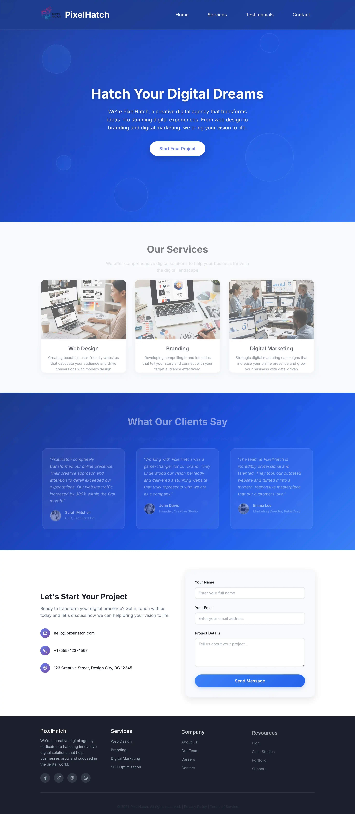

# PixelHatch - Creative Digital Agency Landing Page

A modern, responsive landing page for PixelHatch, a creative digital agency specializing in web design, branding, and digital marketing services.


## 🌟 Features

- **Modern Design**: Clean, professional design with beautiful gradients and animations
- **Fully Responsive**: Optimized for desktop, tablet, and mobile devices
- **Smooth Animations**: Framer Motion animations for enhanced user experience
- **Professional Sections**:
  - Hero section with compelling headline and CTA
  - Services showcase with background images
  - Client testimonials with real photos
  - Contact form with validation
  - Professional footer with social links
- **Performance Optimized**: Built with Next.js for fast loading and SEO
- **Clean Code**: Well-structured, maintainable codebase

## 🚀 Demo

[Live Demo](https://pixel-hatch.netlify.app/)

## 📸 Screenshots



### Key Sections:

- **Hero Section**: Professional hero with gradient background and floating animations
- **Services Section**: Web Design, Branding, and Digital Marketing with background images
- **Testimonials**: Client testimonials with professional photos and glassmorphism design
- **Contact Section**: Clean contact form with company information and social media links

## 🛠️ Technologies Used

- **Framework**: [Next.js 14.2.30](https://nextjs.org/)
- **UI Library**: [React 18](https://reactjs.org/)
- **Styling**: [Styled Components](https://styled-components.com/)
- **Animations**: [Framer Motion](https://www.framer.com/motion/)
- **Form Handling**: [React Hook Form](https://react-hook-form.com/)
- **Icons**: [Tabler Icons React](https://tabler-icons.io/)
- **Deployment**: [Vercel](https://vercel.com/)

## 📁 Project Structure

```
pixelhatch/
├── src/
│   ├── app/
│   │   ├── lib/
│   │   │   └── registry.js          # Styled Components registry
│   │   ├── layout.js                # Root layout with metadata
│   │   └── page.js                  # Main page component
│   ├── components/
│   │   ├── Header.js                # Navigation header
│   │   ├── HeroSection.js           # Hero section with CTA
│   │   ├── ServicesSection.js       # Services showcase
│   │   ├── TestimonialsSection.js   # Client testimonials
│   │   ├── ContactSection.js        # Contact form
│   │   └── CTAAndFooter.js          # Footer with social links
│   └── styles/
│       └── GlobalStyles.js          # Global styling
├── public/
│   └── images/                      # Static images
│       ├── web-design.webp
│       ├── branding.webp
│       ├── digital-marketing.webp
│       ├── testimonial-01.webp
│       ├── testimonial-02.webp
│       └── testimonial-03.webp
├── package.json
└── README.md
```

## 🚀 Getting Started

### Prerequisites

- Node.js 18.x or later
- npm or yarn package manager

### Installation

1. **Clone the repository**

   ```bash
   git clone https://github.com/Chandan-devs-tech/pixelhatch.git
   cd pixelhatch-landing-page
   ```

2. **Install dependencies**

   ```bash
   npm install
   # or
   yarn install
   ```

3. **Run the development server**

   ```bash
   npm run dev
   # or
   yarn dev
   ```

4. **Open your browser**
   Navigate to [http://localhost:3000](http://localhost:3000) to see the application.

### Building for Production

```bash
# Build the application
npm run build

# Start production server
npm run start
```

## 🎨 Customization

### Colors & Branding

The main brand colors are defined in the styled components:

- **Primary Blue**: `#3b82f6` to `#1d4ed8` (gradient)
- **Background**: Light gray `#f8fafc`
- **Text**: Dark gray `#1a202c`

### Images

Replace the images in the `public/images/` directory:

- **Service images**: web-design.webp, branding.webp, digital-marketing.webp
- **Testimonial photos**: testimonial-01.webp, testimonial-02.webp, testimonial-03.webp

### Content

Update the content in each component file:

- **Services**: Edit `ServicesSection.js` to modify service descriptions
- **Testimonials**: Update `TestimonialsSection.js` with real client feedback
- **Contact Info**: Modify `ContactSection.js` with your actual contact details

## 📱 Responsive Design

The landing page is fully responsive with breakpoints at:

- **Desktop**: 1200px and above
- **Tablet**: 768px - 1199px
- **Mobile**: Below 768px

## 🔧 Development

### Available Scripts

- `npm run dev` - Start development server
- `npm run build` - Build for production
- `npm run start` - Start production server
- `npm run lint` - Run ESLint

### Code Style

- **Components**: Functional components with hooks
- **Styling**: Styled Components with responsive design
- **Animations**: Framer Motion for smooth transitions
- **Forms**: React Hook Form for validation

## 🚀 Deployment

### Vercel (Recommended)

1. Push your code to GitHub
2. Connect your repository to [Vercel](https://vercel.com)
3. Deploy automatically with every push

### Netlify

1. Build the project: `npm run build`
2. Deploy the `out` folder to [Netlify](https://netlify.com)

### Other Platforms

The project can be deployed to any platform that supports Next.js applications.

## 🤝 Contributing

1. Fork the repository
2. Create a feature branch (`git checkout -b feature/amazing-feature`)
3. Commit your changes (`git commit -m 'Add amazing feature'`)
4. Push to the branch (`git push origin feature/amazing-feature`)
5. Open a Pull Request

## 📄 License

This project is licensed under the MIT License - see the [LICENSE](LICENSE) file for details.

## 👤 Author

**Your Name**

- GitHub: [Chandan Gupta](https://github.com/Chandan-devs-tech)
- Email: chandanguptabsb@gmail.com

## 🙏 Acknowledgments

- **Design Inspiration**: Modern SaaS landing pages
- **Icons**: [Tabler Icons](https://tabler-icons.io/)
- **Images**: Custom testimonial photos
- **Animations**: [Framer Motion](https://www.framer.com/motion/)

## 📞 Support

If you have any questions or need help with the project, please [open an issue](https://github.com/your-username/pixelhatch-landing-page/issues) or contact me directly.

---

⭐ **Star this repository if it helped you!**
